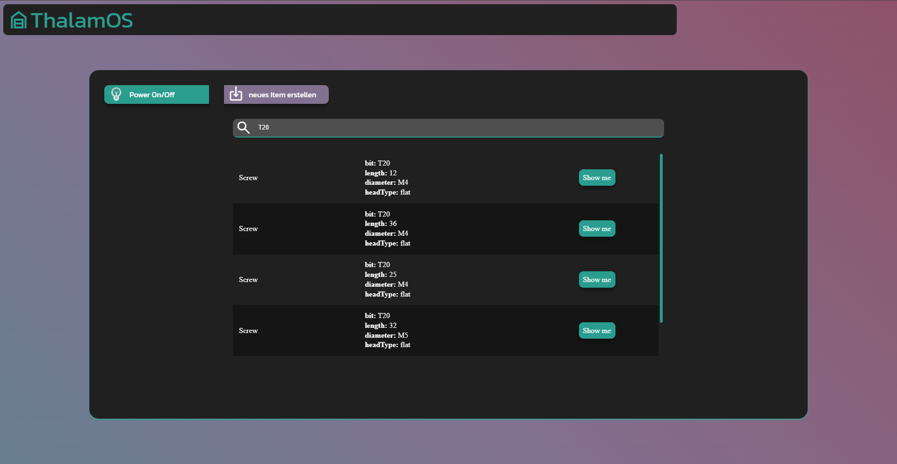
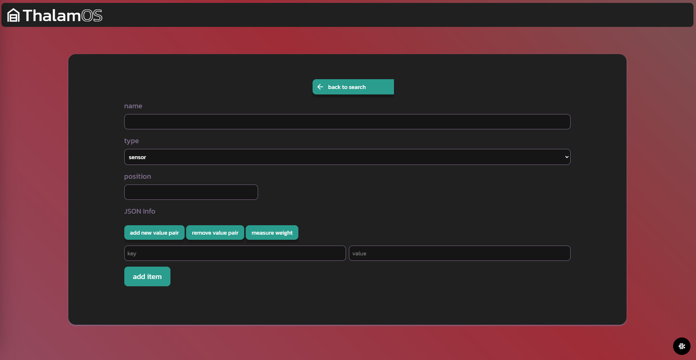

# ThalamOS
Thalamos is a powerful Flask web application designed to enhance your storage management. It utilizes the WLED-API to light up the item you are looking for.
## Etymology

The name **ThalamOS** is derived from the Latin word *thalamus*, which means "inner chamber" or "storage room." This reflects the application's purpose of managing and organizing storage spaces efficiently.
## Features

- **LED Integration**: Controls an addressable LED strip via WLED to highlight the correct location of your items.
- **Custom Properties**: Save any property with your stored items using the info field, allowing for infinite key-value pairs.
- **Search Functionality**: Easily search for items and see their location light up on your storage shelf.
- **Lightweight**: Built with SQLite and Flask, ensuring minimal resource usage and easy deployment.
- **Easy Deployment**: Deploy effortlessly using a Docker container.

## Installation
### Pull the latest build from Docker Hub (the easy way)

1. Pull the latest image from Docker Hub:
    ```bash
    docker pull pixelwelt/thalamos:latest
    ```
2. setup your data directory and add  the `WLED_HOST` enviroment variable:
    ```/data/.env
    WLED_HOST="ip-adress"
    ```
3. Setup your compose file
    ```docker-compose
    version: "3.9"
    services:
        thalamos:
            image: PixelWelt/thalamos:latest
            ports:
            - "8000:80"
            volumes:
            - ./data:/app/data 
    ```
4. Start the service
    ```bash
    docker-compose up
    ```
### Build it yourself

1. Clone the repository:
    ```bash
    git clone https://github.com/yourusername/thalamos.git
    ```
2. Navigate to the project directory:
    ```bash
    cd thalamos
    ```
3. Build the Docker image:
    ```bash
    docker build -t PixelWelt/thalamos .
    ```
4. Insert your WLED_HOST into the `.env.example` file and rename it to `.env`.
5. Run the application using the Docker Compose file:
    ```bash
    docker-compose up
    ```
1. Clone the repository:
    ```bash
    git clone https://github.com/yourusername/thalamos.git
    ```
2. Navigate to the project directory:
    ```bash
    cd thalamos
    ```
3. Build the container:
    ```bash
    docker build -t PixelWelt/thalamos .
    ```
4. insert your WLED_HOST into the .env.example file and rename it to .env
5. Run the application using the docker compose file:
    ```bash
    docker-compose up
    ```

## Usage

1. Open your web browser and go to `http://localhost:8000`.
2. Add your stored items along with their properties.
3. Use the search functionality to find items and see their location light up on your storage shelf.

## Images



## Contributing

Contributions are welcome! Please fork the repository and submit a pull request.

## License

This project is licensed under the MIT License.

## Contact

For any questions or suggestions, please open an issue or contact the repository owner.
