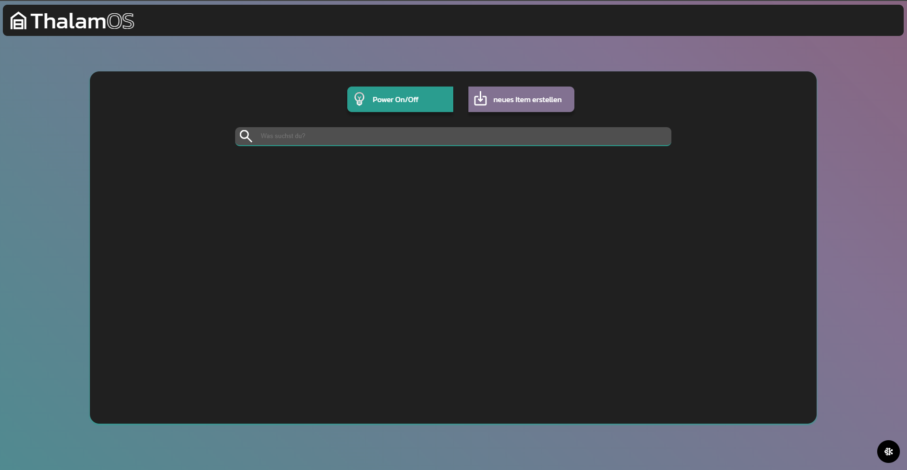

# ThalamOS
Thalamos is a powerful Flask web application designed to enhance your storage management. It utilizes the WLED-API to light up the item you are looking for.
## Etymology

The name **ThalamOS** is derived from the Latin word *thalamus*, which means "inner chamber" or "storage room." This reflects the application's purpose of managing and organizing storage spaces efficiently.
## Features

- **LED Integration**: Controls an addressable LED strip via WLED to highlight the correct location of your items.
- **Custom Properties**: Save any property with your stored items using the info field, allowing for infinite key-value pairs.
- **Search Functionality**: Easily search for items and see their location light up on your storage shelf.
- **Lightweight**: Built with SQLite and Flask, ensuring minimal resource usage and easy deployment.
- **Easy Deployment**: Deploy effortlessly using a Docker container.

## Documentation
The ThalamOS code documentation, generated with Doxygen, is available at: [https://pixelwelt.github.io/ThalamOS/](https://pixelwelt.github.io/ThalamOS/)

Credits to [jothepro/doxygen-awesome-css](https://github.com/jothepro/doxygen-awesome-css) for providing the CSS files for the documentation.

## Installation
### Pull the latest build from Docker Hub (the easy way)

1. Pull the latest image from Docker Hub:
    ```bash
    docker pull pixelwelt/thalamos:latest
    ```
2. setup your data directory and add  the `WLED_HOST` enviroment variable:
    ```/data/.env
    WLED_HOST="ip-adress"
    ```
3. Setup your compose file
    ```docker-compose
    services:
        thalamos:
            container_name: ThalamOS
            image: pixelwelt/thalamos:latest
            restart: always
            ports:
            - "8000:8000"
            volumes:
            - ./data:/app/app/data
    ```
4. Start the service
    ```bash
    docker-compose up
    ```
### Build it yourself

1. Clone the repository:
    ```bash
    git clone https://github.com/yourusername/thalamos.git
    ```
2. Navigate to the project directory:
    ```bash
    cd thalamos
    ```
3. Build the Docker image:
    ```bash
    docker build -t PixelWelt/thalamos .
    ```
4. Insert your WLED_HOST into the `.env.example` file and rename it to `.env`.
5. Run the application using the Docker Compose file:
    ```bash
    docker-compose up
    ```
1. Clone the repository:
    ```bash
    git clone https://github.com/yourusername/thalamos.git
    ```
2. Navigate to the project directory:
    ```bash
    cd thalamos
    ```
3. Build the container:
    ```bash
    docker build -t PixelWelt/thalamos .
    ```
4. insert your WLED_HOST into the .env.example file and rename it to .env
5. Run the application using the docker compose file:
    ```bash
    docker-compose up
    ```

## Usage

1. Open your web browser and go to `http://localhost:8000`.
2. Add your stored items along with their properties.
3. Use the search functionality to find items and see their location light up on your storage shelf.

## optional Modules
### Weighfi - Where pounds meet packets
Weigh-fi is a WiFi-enabled scale with API access, allowing users to easily add weight measurements when using ThalamOS. To enable it:

1. Add the IP address of your Weigh-fi device to the `.env` file.
2. Read more about how to build your own Weigh-fi device [here](https://github.com/PixelWelt/Weigh-fi).

#### To-Dos
- [x] Implement software
- [ ] Create a 3D model
- [ ] Create a working PCB

### ThalamOS AI assistant
Why should I use AI in my storage management? - Because you can!
The ThalamOS AI assistant helps you manage your storage more efficiently. It uses Retrieval-Augmented Generation (RAG) to access your database in read-only mode, helping you find your items faster. It can also answer simple questions.

**Note:** The AI assistant is still in development and may not work as expected. Deepseek Models are not yet supported.

To enable the ThalamOS AI assistant:
1. Enable it in the `.env` file.
2. Add the IP address of your Ollama Server.

Framework: [Haystack](https://github.com/deepset-ai/haystack)

The specific pipeline steps are shown in the picture below:


### To-Dos
- [x] Implement basic ai usage
- [ ] Implement Deepseek Models
- [ ] Improve pipeline to prevent errors from happening
- [ ] make the AI even smarter, by adding more context

## Images


## Contributing

Contributions are welcome! Please fork the repository and submit a pull request.

## License

This project is licensed under the MIT License.

## Contact

For any questions or suggestions, please open an issue or contact the repository owner.
