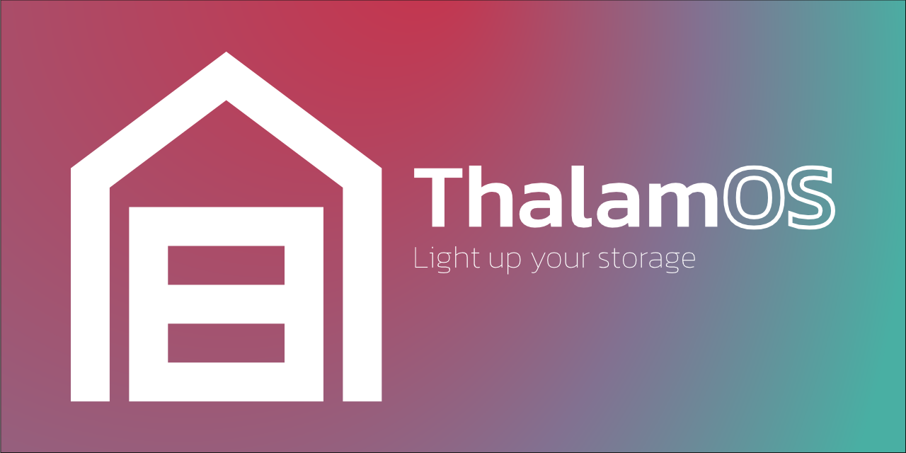

# ThalamOS
Thalamos ist eine leistungsstarke Flask-Webanwendung, die dein Lagermanagement verbessert. Sie nutzt die WLED-API, um den gesuchten Artikel zu aufleuchten zu lassen.
## Etymologie

Der Name **ThalamOS** leitet sich vom lateinischen Wort *thalamus* ab, das "inneres Zimmer" oder "Lagerraum" bedeutet. Dies spiegelt den Zweck der Anwendung wider, Lagerflächen effizient zu verwalten und zu organisieren.
## Funktionen

- **LED-Integration**: Steuert einen adressierbaren LED-Streifen über WLED, um den richtigen Standort Ihrer Artikel hervorzuheben.
- **Benutzerdefinierte Eigenschaften**: Speicher beliebige Eigenschaften mit deinen gelagerten Artikeln im Info-Feld, was unendliche Schlüssel-Wert-Paare ermöglicht.
- **Suchfunktionalität**: Suche einfach nach Artikeln und sehe deren Standort auf deinem Lagerregal aufleuchten.
- **Leichtgewichtig**: Entwickelt mit SQLite und Flask, was minimalen Ressourcenverbrauch und einfache Bereitstellung gewährleistet.
- **Einfache Bereitstellung**: Mühelose Bereitstellung mit einem Docker-Container.

## Dokumentation
Die ThalamOS-Code-Dokumentation, erstellt mit Doxygen, ist verfügbar unter: [https://pixelwelt.github.io/ThalamOS/](https://pixelwelt.github.io/ThalamOS/)

Dank an [jothepro/doxygen-awesome-css](https://github.com/jothepro/doxygen-awesome-css) für die Bereitstellung der CSS-Dateien für die Dokumentation.

## Installation
### Das neueste Build von Docker Hub ziehen (der einfache Weg)

1. Ziehe das neueste Image von Docker Hub:
    ```bash
    docker pull pixelwelt/thalamos:latest
    ```
2. Richte dein Datenverzeichnis ein und füge die `WLED_HOST` Umgebungsvariable hinzu:
    ```/data/.env
    WLED_HOST="ip-adresse"
    ```
3. Richte deine Compose-Datei ein
    ```docker-compose
    services:
        thalamos:
            container_name: ThalamOS
            image: pixelwelt/thalamos:latest
            restart: always
            ports:
            - "8000:8000"
            volumes:
            - ./data:/app/app/data
    ```
4. Starte den Dienst
    ```bash
    docker-compose up
    ```
### Selbst bauen

1. Klone das Repository:
    ```bash
    git clone https://github.com/yourusername/thalamos.git
    ```
2. Navigiere zum Projektverzeichnis:
    ```bash
    cd thalamos
    ```
3. Baue das Docker-Image:
    ```bash
    docker build -t PixelWelt/thalamos .
    ```
4. Füge deine WLED_HOST in die `.env.example` Datei ein und benenne sie in `.env` um.
5. Führe die Anwendung mit der Docker Compose-Datei aus:
    ```bash
    docker-compose up
    ```

## Nutzung

1. Öffne deinen Webbrowser und gehe zu `http://localhost:8000`.
2. Füge deine gelagerten Artikel zusammen mit ihren Eigenschaften hinzu.
3. Verwende die Suchfunktion, um Artikel zu finden und sehe deren Standort auf deinem Lagerregal aufleuchten.

## Bilder


## Mitwirken

Beiträge sind willkommen! Bitte forke das Repository und reiche einen Pull-Request ein.

## Lizenz

Dieses Projekt ist unter der MIT-Lizenz lizenziert.

## Kontakt

Bei Fragen oder Vorschlägen öffne bitte ein Issue oder kontaktiere den Repository-Besitzer.
